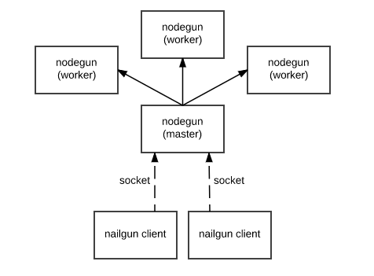

# Nodegun

Nailgun for Node.js

## Purpose

Nodegun improve start up overhead for Node.js programs.

```js
// helloworld.js
console.log('Hello world');
```

```sh
$ time node helloworld.js
Hello world
real    0m0.102s

$ time ng helloworld.js
Hello world
real    0m0.004s
```

## Architecture

Nodegun is inspired by [Nailgun](http://www.martiansoftware.com/nailgun/), a system for reducing startup overhead of
Java programs. Users invoke a small executable (written in C), which connects to a long-running JVM server where the
work is actually performed.

Nodegun is a Node.js server implementation of the Nailgun protocol. Users connect with the same native client, which
submits work to the server.

Nodegun can run either as a single process, as master-worker for parallelized workloads:

<div style="text-align:center"></div>

## Getting started

1. Install the nailgun client, either from [source](https://github.com/martylamb/nailgun) or from your package manager. E.g. for Ubuntu,

```sh
$ apt-get install nailgun
```

2. Install and run nodegun.

```sh
$ npm install -g nodegun
$ nodegun
```

3. Create a Node.JS program to run (aka a "nail").

```js
// example_nail.js
console.log(process.argv.slice(2).join('-'));
```

4. Run the client 

```sh
$ ng example_nail The Fast and the Furious
$ # (or ng-nailgun ...)
The-Fast-and-the-Furious
```

## Nails

### Requirements

Most Node.JS programs should work as nails without modification. Nodegun adjusts the runtime environment, including

* `process.argv`
* `process.env`
* `process.exit`
* `process.stdin`, `process.stdout`, `process.stderr`

The most significant requirement: Nails must clean up after themselves. They must not corrupt state, create memory
leaks, etc.

The root nail module and re-run each time. Modules required by the nail module are run only once. In both cases, code
is cached via the standard `require` mechanism. The server must be restarted if nails are updated on disk.

### Resolution

Nodegun resolves the requested nail

1. As `node` would do, i.e. relative to the current directory.
2. As `require` would do from nodegun process.

### Concurrency

Each worker process (or the main process, if there are no workers) runs only one nail at a time.

### Examples

Nodegun comes with a few [built-in nails](examples/), including

* `ng ./examples/hello` - Print `Hello World`
* `ng ./examples/info` - Print arguments and working direcotry
* `ng ./examples/echo` - Copy stdin to stdout

## What is this good for?

We use Nodegun in our build system. A fast CLI to Node.js amenable to in concurrent, polyglot build systems.

In this way, it is similar to Nailgun, which is used in build tools like [Buck](https://buckbuild.com/) and
[Pants](http://www.pantsbuild.org/).

## Server options

```
usage: main.js [-h] [-v] [--tcp [TCP] | --local [LOCAL]]
               [--status-tcp TCP | --status-local LOCAL] [--workers [WORKERS]]
               

Node.js server that supports the Nailgun protocol.

Optional arguments:
  -h, --help            Show this help message and exit.
  -v, --version         Show program's version number and exit.
  --workers [WORKERS]   If present, number of worker processes to start. A 
                        flag with no argument starts one per CPU.

Transport:
  Transport and address. TCP is used by default.

  --tcp [TCP]           TCP address to listen to, given as ip, port, or 
                        ip:port. IP defaults to 0.0.0.0, and port defaults to 
                        2113.
  --local [LOCAL]       Local address to listen to. Defaults to /tmp/nodegun.
                        sock.

Status:
  Optionally expose internal status information via HTTP server.

  --status-tcp TCP      TCP address to listen to for status, given as ip, 
                        port, or ip:port. IP defaults to 0.0.0.0.
  --status-local LOCAL  Local address to listen to for status.
```
